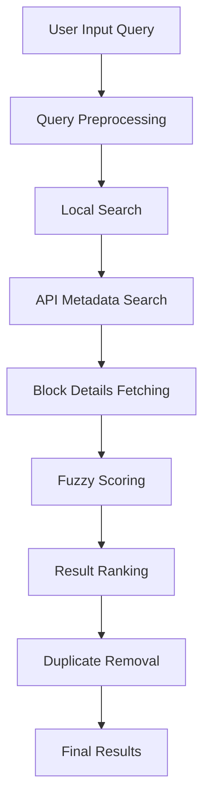

# Block Search Algorithm Documentation

## Overview

The Block Search Algorithm is a sophisticated fuzzy search system designed for finding UI components and blocks within the FlyonUI extension. It combines local search capabilities with remote API integration to provide intelligent, typo-tolerant search functionality for developers.

## System Architecture

The search system consists of two main components:

1. **Component Search (`use-component-search.tsx`)** - Handles metadata searching
2. **Block Search (`use-block-search.tsx`)** - Main search orchestrator with fuzzy matching

## Core Algorithm Flow



## 1. Query Preprocessing

### Input Sanitization

- Converts query to lowercase
- Trims whitespace
- Filters out common UI terms that don't add search value

### UI Terms Filtering

The system ignores these common terms during search:

```javascript
const UI_TERMS_TO_IGNORE = [
  'component', 'components', 'section', 'sections', 
  'element', 'elements', 'ui', 'part', 'parts',
  'piece', 'pieces', 'block', 'blocks', 
  'module', 'modules', 'item', 'items'
]
```

## 2. Multi-Phase Search Strategy

### Phase 1: Local Search

- Searches through locally available blocks first
- Provides immediate feedback to users
- Uses fuzzy matching with lower threshold (0.3) for better recall

### Phase 2: API Metadata Search

- Fetches component metadata from FlyonUI API
- Uses the component search algorithm to find relevant categories/paths
- Applies fuzzy scoring to metadata

### Phase 3: Block Details Fetching

- Fetches detailed block information for relevant paths
- Converts API responses to standardized BlockItem format
- Handles multiple blocks per path

### Phase 4: Final Ranking

- Combines local and API results
- Removes duplicates based on path
- Applies final fuzzy search for optimal ranking

## 3. Fuzzy Scoring Algorithm

The fuzzy scoring system uses a multi-layered approach with industry-standard practices:

### Scoring Hierarchy (Block Search)

#### Tier 1: Exact Matches (Scores: 0.92-1.0)

```javascript
if (title === searchTerm) return 1.0;          // Perfect title match
if (name === searchTerm) return 0.98;          // Perfect name match
if (title.startsWith(searchTerm)) return 0.95; // Title prefix match
if (name.startsWith(searchTerm)) return 0.92;  // Name prefix match
```

#### Tier 2: Partial Matches (Scores: 0.62-0.85)

```javascript
if (title.includes(searchTerm)) return 0.85;   // Title contains match
if (name.includes(searchTerm)) return 0.8;     // Name contains match
```

#### Tier 3: Word-Level Matches (Scores: 0.62-0.75)

For multi-word searches, individual words are matched:

```javascript
if (title.startsWith(word)) return 0.75;       // Word prefix in title
if (name.startsWith(word)) return 0.72;        // Word prefix in name
if (title.includes(word)) return 0.65;         // Word contains in title
if (name.includes(word)) return 0.62;          // Word contains in name
```

#### Tier 4: Similarity Scores (Scores: 0-0.6)

Uses Levenshtein distance and character overlap for typo tolerance.

### Component Search Scoring

Similar hierarchy but focused on component names:

```javascript
if (name === termToMatch) return 1.0;          // Perfect match
if (name.startsWith(termToMatch)) return 0.95; // Prefix match
if (name.includes(termToMatch)) return 0.85;   // Contains match
// Word-level matching: 0.7-0.8
// Similarity scoring: 0-0.7
```

## 4. String Similarity Algorithms

### Levenshtein Distance

Calculates the minimum number of single-character edits (insertions, deletions, substitutions) needed to transform one string into another.

```javascript
function levenshteinDistance(str1, str2) {
  // Creates a matrix to store edit distances
  const matrix = Array(str2.length + 1)
    .fill(null)
    .map(() => Array(str1.length + 1).fill(null));
  
  // Initialize base cases
  for (let i = 0; i <= str1.length; i++) matrix[0][i] = i;
  for (let j = 0; j <= str2.length; j++) matrix[j][0] = j;
  
  // Fill the matrix using dynamic programming
  for (let j = 1; j <= str2.length; j++) {
    for (let i = 1; i <= str1.length; i++) {
      const substitutionCost = str1[i - 1] === str2[j - 1] ? 0 : 1;
      matrix[j][i] = Math.min(
        matrix[j][i - 1] + 1,                    // deletion
        matrix[j - 1][i] + 1,                    // insertion
        matrix[j - 1][i - 1] + substitutionCost  // substitution
      );
    }
  }
  
  return matrix[str2.length][str1.length];
}
```

### Character Overlap Scoring

Measures the similarity between two strings based on shared characters:

```javascript
function getCharacterOverlap(str1, str2) {
  const chars1 = new Set(str1.toLowerCase());
  const chars2 = new Set(str2.toLowerCase());
  
  const intersection = new Set([...chars1].filter(x => chars2.has(x)));
  const union = new Set([...chars1, ...chars2]);
  
  return intersection.size / union.size; // Jaccard similarity
}
```

### Enhanced Word Matching

Handles multi-word searches with typo tolerance:

```javascript
// For each search word, find best matching target word
searchWords.forEach(searchWord => {
  targetWords.forEach(targetWord => {
    // Check for inclusions
    if (targetWord.includes(searchWord) || searchWord.includes(targetWord)) {
      bestWordScore = Math.max(bestWordScore, 1.0);
      return;
    }
    
    // Apply Levenshtein with 30% tolerance
    const wordDistance = levenshteinDistance(searchWord, targetWord);
    const maxWordDistance = Math.max(1, Math.floor(searchWord.length * 0.3));
    
    if (wordDistance <= maxWordDistance) {
      const wordSimilarity = 1 - wordDistance / Math.max(searchWord.length, targetWord.length);
      bestWordScore = Math.max(bestWordScore, wordSimilarity * 0.9);
    }
  });
});
```

## 5. Typo Tolerance Strategy

### Adaptive Error Tolerance

The system uses adaptive error tolerance based on query length:

- **Short queries (≤8 chars)**: 25% error rate maximum
- **Word-level**: 30% error rate per word
- **Minimum distance**: At least 2 characters for very short terms

### Error Rejection Mechanism

```javascript
const maxAllowedDistance = Math.max(2, Math.floor(search.length * 0.25));
if (distance > maxAllowedDistance) {
  return 0; // Reject matches with too many errors
}
```

## 6. Result Ranking and Sorting

### Primary Sorting: Relevance Score

Results are primarily sorted by their fuzzy match score (highest first).

### Secondary Sorting: Natural Order

For items with similar scores (difference < 0.01), natural sorting is applied:

```javascript
const collator = new Intl.Collator(undefined, {
  numeric: true,      // Handles numeric sequences correctly
  sensitivity: 'base' // Case-insensitive comparison
});
```

This ensures proper ordering like: "Hero 1", "Hero 2", "Hero 11" (not "Hero 1", "Hero 11", "Hero 2").

## 7. Performance Optimizations

### Debouncing

- Default 300ms debounce to prevent excessive API calls
- Configurable through options

### Early Termination

- Shows local results immediately
- API results enhance but don't block initial response

### Result Limiting

- Default maximum of 20 API results per search
- Configurable through options

### Duplicate Prevention

```javascript
function removeDuplicateBlocks(blocks) {
  const seen = new Set();
  return blocks.filter(block => {
    if (seen.has(block.path)) return false;
    seen.add(block.path);
    return true;
  });
}
```

## 8. API Integration

### API Error Handling

- Graceful fallback to local results on API failure
- 5-second timeout for API requests
- Warning logs for debugging

### Data Transformation

API responses are normalized to the standard BlockItem format:

```typescript
interface BlockItem {
  path: string;        // Unique identifier
  title: string;       // Display name
  description: string; // Component description
  category: 'popular' | 'recent';
  name?: string;       // Alternative name
}
```

### Authentication

Optional license key support for premium features:

```javascript
const headers = {
  Accept: '*/*',
  'Content-Type': 'application/json',
  ...(licenseKey && { 'x-license-key': licenseKey })
};
```

## 9. Configuration Options

The search system is highly configurable:

```typescript
interface UseBlockSearchOptions {
  licenseKey?: string;  // API authentication
  debounceMs?: number;  // Search delay (default: 300ms)
  minScore?: number;    // Minimum match score (default: 0.35)
  maxResults?: number;  // Maximum API results (default: 20)
}
```

## 10. Usage Example

```typescript
const {
  searchResults,
  isSearching,
  searchError,
  performLocalSearch,
  fuzzySearchBlocks
} = useBlockSearch(
  'hero section',      // Search query
  localBlocks,         // Local block data
  {
    licenseKey: 'your-license-key',
    debounceMs: 300,
    minScore: 0.35,
    maxResults: 20
  }
);
```

## 11. Algorithm Complexity

### Time Complexity

- **Levenshtein Distance**: O(m × n) where m, n are string lengths
- **Overall Search**: O(k × m × n) where k is number of blocks
- **Sorting**: O(k log k) where k is number of matching results

### Space Complexity

- **Levenshtein Matrix**: O(m × n)
- **Result Storage**: O(k) where k is number of results
- **Character Sets**: O(alphabet size) ≈ O(1)

## 12. Best Practices and Considerations

### Search Query Guidelines

- Shorter, focused queries work better
- Avoid redundant UI terms
- Use specific component names when known

### Performance Considerations

- Local search provides immediate feedback
- API search enhances results but shouldn't block UX
- Debouncing prevents API spam

### Error Handling

- Always provide fallback to local results
- Log errors for debugging but don't break user experience
- Handle network timeouts gracefully

## 13. Future Improvements

### Potential Enhancements

1. **Machine Learning**: Train models on user click patterns
2. **Semantic Search**: Use embedding-based similarity
3. **Context Awareness**: Consider current project type/framework
4. **Caching**: Cache API results to improve performance
5. **Analytics**: Track search patterns to improve algorithm

### Performance Optimizations

1. **Incremental Search**: Update results as user types
2. **Background Prefetching**: Preload popular components
3. **Index Building**: Create searchable indexes for faster lookup
4. **Web Workers**: Move heavy computations off main thread

This algorithm represents a production-ready, sophisticated search system that balances accuracy, performance, and user experience while providing robust fuzzy matching capabilities for UI component discovery.
